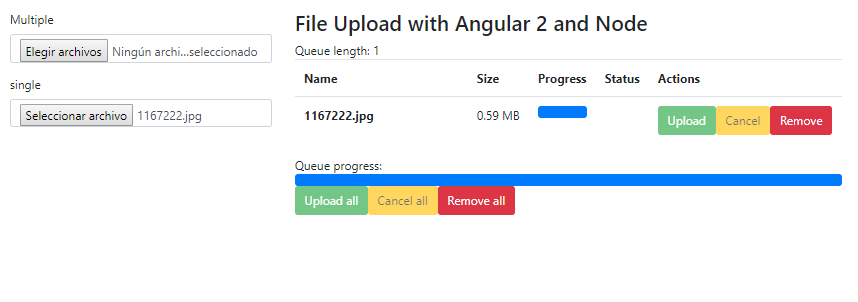

# Angular6-Nodejs-uploader
angular 6 and nodejs file uploader example

agular-6-uploader
	
	npm install
	npm audit fix -- force 

	npm start  //RUN 

code:
app.module.ts

	import {FileSelectDirective} from 'ng2-file-upload';
	@NgModule({
	    declarations: [
		AppComponent,
		FileSelectDirective
	    ],

app.component.ts

	import { Component } from '@angular/core';
	import { FileUploader } from 'ng2-file-upload';
	@Component({
	  selector: 'app-root',
	  templateUrl: './app.component.html',
	  styleUrls: ['./app.component.css']
	})
	export class AppComponent {
	    public uploader:FileUploader = new FileUploader({url:'http://localhost:3001/upload'});
	}
	
app.component.html

	<nav class="navbar navbar-default">
	    

		

		    

			<ul class="nav navbar-nav">
			    <li><a>File Upload</a></li>
			</ul>
		    

		

	    

	</nav>
	

	    

		

		    <form>
			

			    <label for="multiple">Multiple</label>
			    <input type="file" class="form-control" name="multiple" ng2FileSelect [uploader]="uploader" multiple  />
			

			

			    <label for="single">single</label>
			    <input type="file" class="form-control" name="single" ng2FileSelect [uploader]="uploader" />
			

		    </form>
		

		

		    <h3>File Upload with Angular 2 and Node</h3>
		    Queue length: {{ uploader?.queue?.length }}

		    <table class="table">
			<thead>
			<tr>
			    <th width="50%">Name</th>
			    <th>Size</th>
			    <th>Progress</th>
			    <th>Status</th>
			    <th>Actions</th>
			</tr>
			</thead>
			<tbody>
			<tr *ngFor="let item of uploader.queue">
			    <td><strong>{{ item.file.name }}</strong></td>
			    <td nowrap>{{ item.file.size/1024/1024 | number:'.2' }} MB</td>
			    <td>
				

				    

				

			    </td>
			    <td class="text-center">
				<i class="glyphicon glyphicon-ok"></i>
				<i class="glyphicon glyphicon-ban-circle"></i>
				<i class="glyphicon glyphicon-remove"></i>
			    </td>
			    <td nowrap>
				<button type="button" class="btn btn-success btn-xs"
					(click)="item.upload()" [disabled]="item.isReady || item.isUploading || item.isSuccess">
				     Upload
				</button>
				<button type="button" class="btn btn-warning btn-xs"
					(click)="item.cancel()" [disabled]="!item.isUploading">
				     Cancel
				</button>
				<button type="button" class="btn btn-danger btn-xs"
					(click)="item.remove()">
				     Remove
				</button>
			    </td>
			</tr>
			</tbody>
		    </table>

		    

			

			    Queue progress:
			    

				

			    

			

			<button type="button" class="btn btn-success btn-s"
				(click)="uploader.uploadAll()" [disabled]="!uploader.getNotUploadedItems().length">
			     Upload all
			</button>
			<button type="button" class="btn btn-warning btn-s"
				(click)="uploader.cancelAll()" [disabled]="!uploader.isUploading">
			     Cancel all
			</button>
			<button type="button" class="btn btn-danger btn-s"
				(click)="uploader.clearQueue()" [disabled]="!uploader.queue.length">
			     Remove all
			</button>
		    

		

	    

	

----------------------SERVER-------------------------		
nodejs-server-app

	npm install
	npm audit fix -- force 

	nodemon app.js  //RUN SERVER LOCAL

code:

	var express = require('express');
	var app = express();
	var bodyParser = require('body-parser');
	var multer = require('multer');

	app.use(function(req, res, next) { //allow cross origin requests
	    res.setHeader("Access-Control-Allow-Methods", "POST, PUT, OPTIONS, DELETE, GET");
	    res.header("Access-Control-Allow-Origin", "http://localhost:4200");
	    res.header("Access-Control-Allow-Headers", "Origin, X-Requested-With, Content-Type, Accept");
	    res.header("Access-Control-Allow-Credentials", true);
	    next();
	});

	/** Serving from the same express Server
	 No cors required */
	app.use(express.static('../client'));
	app.use(bodyParser.json());

	var storage = multer.diskStorage({ //multers disk storage settings
	    destination: function (req, file, cb) {
		cb(null, './uploads/');
	    },
	    filename: function (req, file, cb) {
		var datetimestamp = Date.now();
		cb(null, file.fieldname + '-' + datetimestamp + '.' + file.originalname.split('.')[file.originalname.split('.').length -1]);
	    }
	});

	var upload = multer({ //multer settings
	    storage: storage
	}).single('file');

	/** API path that will upload the files */
	app.post('/upload', function(req, res) {
	    upload(req,res,function(err){
		console.log(req.file);
		if(err){
		    res.json({error_code:1,err_desc:err});
		    return;
		}
		res.json({error_code:0,err_desc:null});
	    });
	});

	app.listen('3001', function(){
	    console.log('running on 3001...');
	});
